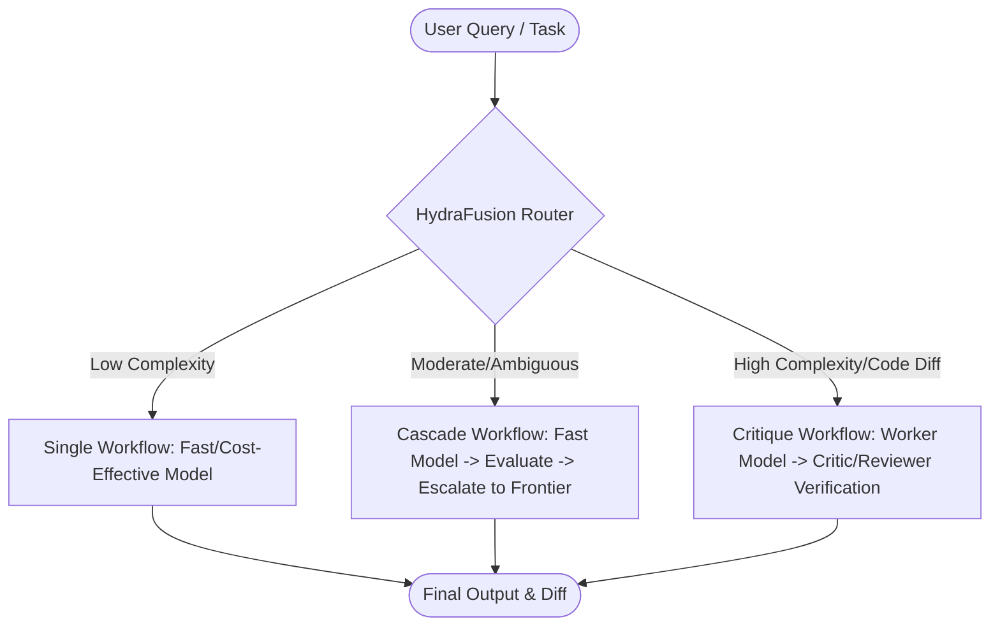

# GitHub Copilot Day 2026: Comprehensive Video Analysis & Notes

**Source File:** `C:\Users\smnk2\Downloads\videoplayback.mp4`  
**Event Title:** GitHub Copilot Day Live: New Releases, Real Workflows, and Live Coding  
**Broadcast Date:** September 10, 2026  
**Total Duration:** 04:11:40 (15,100 seconds / ~251.7 minutes)  
**Resolution / Spec:** 640x360 @ 29.97 fps, AVC1 / AAC stereo, ~301 MB  
**Event URL:** [YouTube: GitHub Official (ID: `0kOXsQUNzss`)](https://www.youtube.com/watch?v=0kOXsQUNzss)  
**Main Stage Anchors:** Burke Holland & Pierce Boggan  
**Keynote & Featured Speakers:**
- **Kyle Daigle** — Chief Operating Officer (COO), GitHub
- **James Montemagno** — Principal Lead Program Manager / Dev Relations, GitHub
- **Matt Pocock** — TypeScript Educator & Creator
- **Julia Kasper & Aashna Garg** — Product Managers / Engineers, GitHub Copilot (Project HydraFusion)
- **Meagan Cojocar** — Product Manager, GitHub Copilot
- **Tyler Leonhardt** — Software Engineer, VS Code / GitHub Copilot Team
- **Patrick Nikoletich** — Principal Engineer, Copilot Agent Runtime & SDK Team
- **Wes Bos** — Full-stack Developer, Educator & Special Live Guest

---

## Executive Summary

**GitHub Copilot Day 2026** is GitHub's flagship 4-hour live conference detailing the paradigm shift from single-line code completion to an **agent-native software engineering lifecycle**. Over four hours of technical keynotes, architectural reveals, and intensive two-hour live pair-programming sessions, GitHub revealed how AI agents are now integrated from ideation to production across every developer surface (CLI, IDE, Web, Mobile, Slack, Teams).

### Top 7 Key Announcements & Core Highlights:
1. **Project HydraFusion (Multi-Model Orchestration Preview):**
   - Moves beyond static "model selection" into dynamic workflow orchestration.
   - Achieves higher benchmark accuracy (+4.9 points on coding tasks) with **36% to 67% lower cost** compared to frontier models like Claude 3.5/Opus 5.
   - Core philosophy: *"Selection has a ceiling, but composition doesn't."*
2. **GitHub Copilot App (`gh.io/app`):**
   - A dedicated desktop control center for managing asynchronous, multi-agent sessions across repositories.
   - Integrates PR reviews, auto-investigation of bug reports, CI/CD telemetry, and direct Slack/Teams steering.
3. **Copilot Agent Runtime & Copilot SDK:**
   - Architecture decoupling: Agents execute in a persistent, portable runtime (locally, in cloud containers, or over Tailscale networks), while developers interact through thin client surfaces.
   - Built on the **Agent Host Protocol (AHP)**, allowing developers to build custom agent tools, UI dashboards, and custom clients.
4. **Agent Skills Framework:**
   - Modular, composable prompt-and-tool packages (e.g., `Show Me` visual architecture generator, PR review skills, test automation).
   - Allows teams to codify internal domain knowledge and architectural patterns that agents automatically discover and execute.
5. **BYOK (Bring Your Own Key) & Expanded Model Choice in VS Code:**
   - Direct integration of custom API keys (Anthropic Claude, OpenAI, OpenRouter) right inside VS Code and the Copilot CLI.
6. **Cross-Surface Continuity:**
   - Unified session persistence across GitHub.com, VS Code, Terminal CLI, GitHub Mobile, Slack, and Microsoft Teams. A developer can start an agent task from a Slack incident thread, inspect visual diffs on their phone, and review the code in VS Code.
7. **The "Chief of Staff" Mental Model:**
   - Developers no longer micromanage code character by character; they act as architects and managers directing autonomous agent swarms, reviewing output, and steering architecture while staying in full control of what gets merged.

---

## Full Chapter-by-Chapter Breakdown & Detailed Timestamps

```
Timeline Map:
00:00:00 - 00:08:00 | Pre-Stream Countdown & Title Slate
00:08:00 - 00:15:20 | Welcome & Keynote Kickoff (Burke Holland, Pierce Boggan & Kyle Daigle)
00:15:20 - 00:46:00 | Dream It, Build It, Ship It (James Montemagno & Pierce Boggan)
00:46:00 - 01:07:00 | Agent Skills: Codifying Expertise (Matt Pocock)
01:07:00 - 01:23:00 | Inside Project HydraFusion: Multi-Model Orchestration (Julia Kasper & Aashna Garg)
01:23:00 - 01:37:45 | Copilot Everywhere: Multi-Surface Continuity (Meagan Cojocar)
01:37:45 - 01:48:00 | Claude, Codex, and BYOK in GitHub Copilot for VS Code (Tyler Leonhardt)
01:48:00 - 02:08:00 | One Session, Every Surface: Agent Runtime & SDK (Patrick Nikoletich)
02:08:00 - 04:11:40 | Live Coding Marathon: Building an Agent-Native App Live (Wes Bos, Burke & Pierce)
```

---

### Segment 1: Welcome & Opening Keynote (00:08:00 - 00:15:20)
**Speakers:** Burke Holland, Pierce Boggan, and Kyle Daigle (GitHub COO)

- **The Evolution of Development:** Kyle opens by highlighting how software creation has transformed. Developers no longer write boilerplate or manually search documentation for hours; modern engineering is centered on expressing intent and guiding autonomous systems.
- **Introducing Project HydraFusion:**
  - Kyle unveils GitHub's latest research preview: **HydraFusion**, a multi-model orchestration engine.
  - Highlights benchmark results: **+4.9 quality points improvement** while slashing estimated inference costs by **67%** compared to standard monolithic frontier runs.
  - Explains that forcing developers to manually select different models for each prompt is inefficient; intelligent orchestration dynamically routes subtasks to the most effective models.
- **The Shared Agent Runtime:**
  - The runtime that powers internal GitHub agents is now made directly accessible to all developers via the **Copilot SDK** and **Copilot CLI**.
  - Philosophy: *"Agents do more of the work, but you still decide what ships."* Human-in-the-loop oversight remains fundamental.

---

### Segment 2: Dream It, Build It, Ship It (00:15:20 - 00:46:00)
**Presenters:** James Montemagno & Pierce Boggan

James showcases the day-to-day workflow of an agent-native engineer using real internal and open-source applications.

- **The GitHub Copilot App (`gh.io/app`):**
  - James demonstrates how the dedicated desktop application centralizes asynchronous development sessions across projects (e.g., `threeup`, `fourup`).
  - Developers can configure routing hints for agent execution:
    - **Efficiency:** Prioritizes speed and low compute cost for rapid iterations.
    - **Balanced:** Standard default balancing speed, cost, and reasoning.
    - **Intelligent:** Deploys deep reasoning models for architectural refactors and complex bugs.
- **MCP (Model Context Protocol) Integration & Canvas Testing:**
  - James demonstrates a Canvas test environment that hosts an embedded MCP server.
  - The agent interacts with the running UI by capturing real-time screenshots, analyzing visual element layout, and inspecting DOM structures without human intervention.
  - Live demo of multi-capture editing and cross-platform build validation (Windows & macOS CI/CD pipeline triggers).
- **Automated Issue Triage & Repo Actions:**
  - Inbound issues and customer bug reports are automatically ingested by agents that generate repro steps, investigate call stacks, and produce draft PRs before an engineer opens their laptop.
  - Repo actions allow engineers to query PRs, trigger tests, and review diffs without leaving the Copilot desktop application.

---

### Segment 3: Agent Skills: Codifying Engineering Patterns (00:46:00 - 01:07:00)
**Presenter:** Matt Pocock

Matt demonstrates how developers can transition from writing one-off prompts to designing **reusable, version-controlled Agent Skills**.

- **What are Agent Skills?**
  - Modular skill packages that define domain-specific knowledge, architectural guidelines, and validation rules.
  - Stored within repositories (`.github/skills/`) or shared across organizations.
- **Demo: The `Show Me` Skill:**
  - Matt demonstrates a skill named `Show Me` that visualizes complex architectural concepts.
  - Instead of responding with walls of text, the agent generates an interactive HTML document rendered inline with architectural diagrams, before-and-after comparison boxes, and type-flow arrows.
  - Example: Refactoring a messy RPC module (`apps/remote/rpc.ts`) into a typed adapter pattern. The visual diff highlights shallow seams, hidden omissions in typecasts, and clean decoupled interfaces.
- **Iterative Shared Understanding:**
  - Matt emphasizes the concept of *"reaching a shared understanding with the agent."*
  - The workflow follows: **Explore -> Sketch Architecture -> Align with Developer -> Generate Draft PR -> Run Automated Verifications**.
  - Skills allow junior and senior engineers alike to enforce repository standards automatically.

---

### Segment 4: Inside Project HydraFusion: Multi-Model Orchestration (01:07:00 - 01:23:00)
**Presenters:** Julia Kasper & Aashna Garg (GitHub Copilot PMs & Engineers)

Julia and Aashna provide an in-depth technical walkthrough of GitHub's new multi-model orchestration engine.

- **The Core Problem:**
  - Developers currently face "model fatigue" (choosing between Claude 3.5 Sonnet, GPT-4o, Opus, Gemini, local models).
  - Choosing a single model for an entire session is inherently suboptimal: simple planning tasks waste high-end reasoning tokens, while cheap models fail on edge cases.
- **HydraFusion Architecture & Workflows:**
  - *"Selection has a ceiling, but composition doesn't."*
  - HydraFusion decomposes incoming developer tasks into three dynamic workflows:
    1. **Single Workflow:** Simple, well-defined tasks (e.g., formatting, quick lookups) are routed directly to lightweight, ultra-fast models.
    2. **Cascade Workflow:** Tasks start with a cost-effective model; if uncertainty thresholds or validation checks fail, it automatically escalates to a frontier reasoning model.
    3. **Critique / Verification Workflow (Dual-Model):** A primary "worker" model generates code changes, and a secondary "critic/reviewer" model (e.g., Sol / Claude Opus) inspects the diff, verifies edge cases, and provides targeted revisions.
- **Benchmark Metrics:**
  - Evaluated on GitHub's internal developer benchmark (**Checkpoint Bench**) and real-world repository workloads.
  - Delivers parity or superior quality compared to Opus 5 while cutting overall token spend by **36% to 67%**.

---

### Segment 5: Copilot Everywhere: Cross-Surface Continuity (01:23:00 - 01:37:45)
**Presenter:** Meagan Cojocar

Meagan demonstrates the unified developer experience across physical devices and communication platforms.

- **Session Portability:**
  - An agent session started on GitHub.com or VS Code is not locked to that machine; it lives in the Copilot runtime.
  - Meagan shows starting a refactoring session from an alert, tracking the agent's progress on GitHub Mobile, and leaving voice/text steering comments while on the go.
- **Slack & Microsoft Teams Bot Integration:**
  - Demonstrates inviting `@GitHub Copilot` directly into team channels.
  - The agent posts structured status updates, responds to developer questions in threads, and executes repository actions with explicit team permissions.

---

### Segment 6: Claude, Codex, and BYOK in GitHub Copilot for VS Code (01:37:45 - 01:48:00)
**Presenter:** Tyler Leonhardt

Tyler details new customization features inside VS Code and the Copilot CLI.

- **Bring Your Own Key (BYOK):**
  - Developers and enterprises can now connect their own API keys from Anthropic, OpenAI, or OpenRouter directly into the Copilot harness.
  - Enables developers to test unreleased models, private fine-tunes, or specialized LLMs inside standard Copilot workflows.
- **Model Switching in the Copilot Agent Harness:**
  - Tyler demonstrates switching models on the fly during a single coding session based on task requirements, while maintaining unified context and tool access.

---

### Segment 7: One Session, Every Surface: Copilot Agent Runtime & SDK (01:48:00 - 02:08:00)
**Presenter:** Patrick Nikoletich

Patrick presents the deep systems engineering behind the new Copilot architecture.

- **Agent Host Protocol (AHP):**
  - An open, standardized protocol that decouples the agent runtime (tools, file access, bash execution, state) from the user interface.
  - Allows the runtime to execute inside isolated sandbox containers, secure cloud VMs, or remote servers accessible via Tailscale.
- **The Copilot SDK:**
  - Developers can build custom frontend clients, command-line interfaces, or automated CI agents that speak directly to the Copilot runtime.
  - Full session playback: sessions can be serialized, replayed, paused, and resumed across different environments without losing context.

---

### Segment 8: Live Coding Marathon (02:08:00 - 04:11:40)
**Coders:** Wes Bos, Burke Holland, Pierce Boggan & Live Stream Guests

A massive, 2-hour live collaborative build demonstrating real-time agent steering, debugging, and multi-agent coordination.

- **Project Vision:**
  - Building a **Foldable Dual-Screen Hardware Emulator** in 3D (Three.js / WebGL / HTML Canvas) with interactive apps running on virtual screens (Surface Duo / foldable mobile form factor).
  - Features an **Exploded "Knolling" View** displaying internal components: circuit boards, screws, capacitors, and articulating hinges.
- **The Workflow in Action:**
  - **Burke** steers the frontend 3D viewport and Canvas rendering in Microsoft Edge, troubleshooting hardware acceleration flags and WebGL contexts.
  - **Pierce** manages the "Agent Control Plane" in the Copilot App, running multiple parallel agents simultaneously:
    - *Agent 1:* Building the backend Copilot bridge.
    - *Agent 2:* Automating headless Chrome browser testing via debugging ports (`localhost:9222`) to capture visual regressions.
    - *Agent 3:* Generating interactive web apps (Calculator, App Store, Settings) to run on the 3D emulator screens.
  - **Wes Bos** provides live architectural feedback, optimizing Three.js scene graphs, CSS canvas scaling, and UI event propagation.
- **Key Live Coding Lessons & Real-World Realities:**
  - *Parallel Agent Management:* Running 4-6 agents simultaneously requires clear prompt specifications and defined boundaries; otherwise, agents may write conflicting files.
  - *Browser Verification Skill:* Letting agents inspect their own visual output using a headless browser skill dramatically reduces hallucinated CSS/layout bugs.
  - *Pivoting vs. Sunk Cost:* When an agent spends too long on an overcomplicated approach (e.g., custom physics calculations for hinges), human steering is essential to tell the agent: *"Stop, reset, and use a simpler matrix transform."*
  - *Token & Credit Awareness:* The team tracks credit utilization live, demonstrating how HydraFusion prevents catastrophic cost overruns during heavy agent usage.

---

## Architectural Deep Dive & Key Concepts

### 1. The Multi-Model Orchestration Matrix (HydraFusion)



- **Single Execution:** Used for deterministic file lookups, docstring generation, syntax corrections.
- **Cascade Escalation:** If unit tests or static analysis fail after the first attempt, context is handed to a deeper reasoning model with error logs.
- **Critique Review Loop:** The worker creates the patch; the critic model checks edge cases, security implications, and style rules before presenting the diff to the human.

### 2. The Decoupled Agent Host Architecture (AHP)

```
+-------------------------------------------------------------+
|                     Client Surfaces                         |
|   VS Code   |   Copilot CLI   |   Copilot App   |   Slack   |
+-------------------------------------------------------------+
                              | (AHP / WebSocket / gRPC)
+-------------------------------------------------------------+
|                   Copilot Agent Runtime                     |
|  - Session State & History    - Tool Sandbox Execution       |
|  - Model Orchestrator         - File System / Git Controller |
|  - MCP Client Connector       - Permission Guardrails        |
+-------------------------------------------------------------+
                              |
+-------------------------------------------------------------+
|                     Execution Targets                       |
|   Localhost   |   Docker / DevContainer   |   Remote VM     |
+-------------------------------------------------------------+
```

---


---

## 👥 Featured Speakers & Profiles

| Speaker | Role / Affiliation | GitHub | LinkedIn |
| :--- | :--- | :--- | :--- |
| **Kyle Daigle** | Chief Operating Officer (COO), GitHub | [@kdaigle](https://github.com/kdaigle) | [in/kyledaigle](https://www.linkedin.com/in/kyledaigle) |
| **Burke Holland** | Principal Developer Advocate, Microsoft / GitHub | [@burkeholland](https://github.com/burkeholland) | [in/burkeholland](https://www.linkedin.com/in/burkeholland) |
| **Pierce Boggan** | Product Lead, VS Code & GitHub Copilot, Microsoft | [@pierceboggan](https://github.com/pierceboggan) | [in/pierceboggan](https://www.linkedin.com/in/pierceboggan) |
| **James Montemagno** | Principal Lead Program Manager, Microsoft DevRel | [@jamesmontemagno](https://github.com/jamesmontemagno) | [in/jamesmontemagno](https://www.linkedin.com/in/jamesmontemagno) |
| **Matt Pocock** | TypeScript Educator, Creator of Total TypeScript & Skills | [@mattpocock](https://github.com/mattpocock) | [in/mattpocock](https://www.linkedin.com/in/mattpocock) |
| **Julia Kasper** | Senior Product Manager, VS Code & GitHub Copilot | [@juliakaspar](https://github.com/juliakaspar) | [in/juliakasper](https://www.linkedin.com/in/juliakasper) |
| **Aashna Garg** | Principal Applied Scientist (Code AI & HyDRA), Microsoft | [@aashnagarg](https://github.com/aashnagarg) | [in/aashnagarg](https://www.linkedin.com/in/aashnagarg) |
| **Meagan Cojocar** | Product Manager, GitHub Copilot (Integrations & Mobile) | [@meagancojocar](https://github.com/meagancojocar) | [in/meagancojocar](https://www.linkedin.com/in/meagancojocar) |
| **Tyler Leonhardt** | Senior Software Engineer, VS Code & Copilot Team | [@TylerLeonhardt](https://github.com/TylerLeonhardt) | [in/tylerleonhardt](https://www.linkedin.com/in/tylerleonhardt) |
| **Patrick Nikoletich** | Principal Software Engineer, Copilot Agent Runtime & SDK | [@patniko](https://github.com/patniko) | [in/patricknikoletich](https://www.linkedin.com/in/patricknikoletich) |
| **Wes Bos** | Full-Stack Developer, Educator & Syntax Podcast Host | [@wesbos](https://github.com/wesbos) | [in/wesbos](https://www.linkedin.com/in/wesbos) |


---

## 🔗 Essential Resources & Technical Links

### 🛠️ Products, Downloads & Documentation
* **GitHub Copilot App:** [https://gh.io/app](https://gh.io/app) — Native desktop application for orchestrating asynchronous multi-agent workflows across repositories.
* **GitHub Copilot CLI:** [GitHub CLI Docs](https://docs.github.com/en/copilot/github-copilot-in-the-cli) — Terminal-native agent workflows powered by HydraFusion.
* **Copilot Dev Days Workshop:** [https://copilot-dev-days.github.io/](https://copilot-dev-days.github.io/) — Interactive labs and hands-on developer guides.
* **Official GitHub Copilot Features:** [https://gh.io/ghcopilot-features](https://gh.io/ghcopilot-features) — Full feature matrix and updates.
* **Official YouTube Broadcast:** [YouTube: GitHub Copilot Day Live (ID: 0kOXsQUNzss)](https://www.youtube.com/watch?v=0kOXsQUNzss).
* **GitHub Universe Conference:** [https://githubuniverse.com/](https://githubuniverse.com/) — Flagship annual GitHub developer conference.

### 📚 Open Source Repositories & Protocols
* **Agent Host Protocol (AHP):** [`microsoft/agent-host-protocol`](https://github.com/microsoft/agent-host-protocol) — Standard open protocol for decoupling agent runtimes from frontend clients.
* **GitHub Copilot SDK:** [`github/copilot-sdk`](https://github.com/github/copilot-sdk) — SDK for programmatically invoking, extending, and embedding the Copilot Agent Runtime.
* **Matt Pocock's Agent Skills:** [`mattpocock/skills`](https://github.com/mattpocock/skills) — Repository of reusable agent skills (including the `Show Me` visual architecture generator).
* **Model Context Protocol (MCP):** [https://modelcontextprotocol.io/](https://modelcontextprotocol.io/) — Open specification for connecting agents to external tools, local files, and browser canvases.
* **Visual Studio Code:** [`microsoft/vscode`](https://github.com/microsoft/vscode) — The open-source code editor supporting agent mode, MCP, and BYOK.

### 🔬 Research & Papers
* **Project HydraFusion / HyDRA Research:** [Microsoft Research: HyDRA - Hybrid Dynamic Routing Architecture](https://arxiv.org/abs/2406.18665) — Technical publication by Aashna Garg et al. on cost-effective, high-accuracy multi-model orchestration.
* **GitHub Technology Blog:** [https://github.blog/](https://github.blog/) — Announcements and engineering deep-dives into agent-native development.

### 🎙️ Community, Media & Podcasts
* **Syntax FM (Wes Bos & Scott Tolinski):** [https://syntax.fm/](https://syntax.fm/) — Leading web development podcast covering AI tools and front-end architectures.
* **Merge Conflict Podcast (James Montemagno & Frank Krueger):** [https://www.mergeconflict.fm/](https://www.mergeconflict.fm/) — Weekly developer podcast discussing AI, mobile, and cloud software engineering.
* **Burke Holland on YouTube:** [Burke Holland Developer Channel](https://www.youtube.com/@BurkeHolland) — Tutorials on VS Code tips, Copilot hacks, and agentic workflows.


## Actionable Developer Takeaways & Best Practices

1. **Adopt the "Chief of Staff" Mindset:**
   - Stop typing line-by-line. Instead, outline specifications, define acceptance criteria, and launch agents to build feature spikes in draft branches.
2. **Standardize Workflows with Agent Skills:**
   - Convert repeated prompts and internal style guides into reusable Skills inside `.github/skills/`. Equip agents with domain-specific tools like visualizers and linters.
3. **Use Headless Browsers for Visual Feedback:**
   - When developing UI, enable an MCP browser tool. Agents that can "see" their own DOM layout produce drastically fewer rendering bugs than text-only agents.
4. **Leverage HydraFusion to Optimize Costs:**
   - Enable HydraFusion in the Copilot CLI and Copilot App to automatically balance performance and cost without having to manually swap models.
5. **Decouple Execution from Your Local Machine:**
   - Use the Copilot SDK and remote runtimes so long-running agent tasks continue executing in the background even if you close your laptop.

---
*Notes compiled from complete automated transcript analysis, frame sampling, and metadata inspection of `videoplayback.mp4`.*
